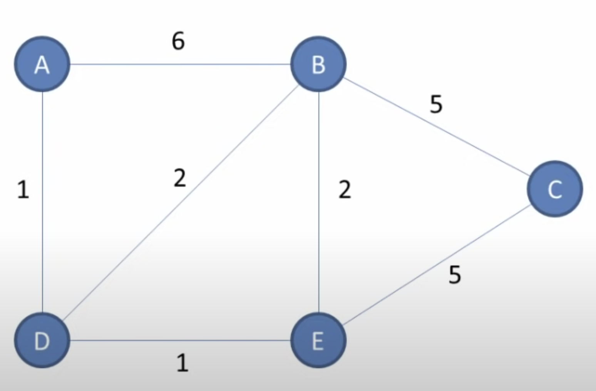
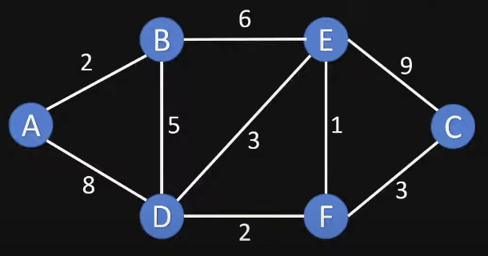

# Dijkstra's Shortest Path Algorithm Typescript Implementation

## goals for this project

-   study and learn about a new algorithm I didn't previously know (in this case dijkstra's shortest path algorithm) ✅
-   study it via wikipedia and youtube conceptual videos ✅
-   based off conceptual information/videos understanding write my own implementaiton without looking at others code/implementations (challenging part) ✅
-   looking at some pseudo code is allowed (though i limited that for this algorithm), but looking at others implementations is disallowed ✅
-   once algorithm is implemented, write unit tests to verify output results are correct given the graph, starting node inputs ✅
-   <em> side quest: test with multiple different graphs to be even more confident in implementation </em> ✅

## running

-   npm i
-   npm run start

## running tests

-   npm run test

## graphs tested with usage code examples
look at index.ts code for example usage! or read below for a more in detail explaination of how to use code. 

### graph A tested with example code usage

algorithm implementation and graph used based off of youtube video https://www.youtube.com/watch?v=pVfj6mxhdMw&t=553s&ab_channel=ComputerScience

<br />


graph data structure representation:

```
const graphA: DijkstrasNonDirectedGraphMap = {
        a: { b: 6, d: 1 },
        b: { a: 6, c: 5, e: 2, d: 2 },
        c: { b: 5, e: 5 },
        d: { a: 1, b: 2, e: 1 },
        e: { d: 1, b: 2, c: 5 },
    };
```

shortest paths results table from node a:
```
const dijkstrasResultsLookUpTableFromNodeA = dijkstrasAlgorithm(
        graphA,
        "a"
    );

// output will be: 
const resultsTableExpected: DijkstrasResultsTableMap = {
    a: { shortestDistanceFromNodeX: 0, previousVertex: null },
    b: { shortestDistanceFromNodeX: 3, previousVertex: "d" },
    c: { shortestDistanceFromNodeX: 7, previousVertex: "e" },
    d: { shortestDistanceFromNodeX: 1, previousVertex: "a" },
    e: { shortestDistanceFromNodeX: 2, previousVertex: "d" },
};
```

get shortest path to c from a:

```
const path = getShortestPath(dijkstrasResultsLookUpTableFromNodeA, "c");
// output will be => ["a", "d", "e", "c"]
```

get shortest path to c from a in directional arrow formatted string:
```
const pathFormattedString = getShortedPathArrowedFormattedString(path);
// output will be: "a --> d --> e --> c"
```

### graph B tested with example code usage

<br />


graph data structure representation:

```
const graphB: DijkstrasNonDirectedGraphMap = {
        a: { b: 2, d: 8 },
        b: { a: 2, e: 6, d: 5 },
        c: { f: 3, e: 9 },
        d: { a: 8, b: 5, e: 3, f: 2 },
        e: { d: 3, b: 6, c: 9, f: 1 },
        f: { d: 2, c: 3, e: 1 },
    };
```

shortest paths results table from node a:
```
const dijkstrasResultsLookUpTableFromA = dijkstrasAlgorithm(graphB, "a");

// output will be:
const resultsTableExpected: DijkstrasResultsTableMap = {
    a: { shortestDistanceFromNodeX: 0, previousVertex: null },
    b: { shortestDistanceFromNodeX: 2, previousVertex: "a" },
    c: { shortestDistanceFromNodeX: 12, previousVertex: "f" },
    d: { shortestDistanceFromNodeX: 7, previousVertex: "b" },
    e: { shortestDistanceFromNodeX: 8, previousVertex: "b" },
    f: { shortestDistanceFromNodeX: 9, previousVertex: "d" },
};
```

get shortest path to c from a:

```
const path = getShortestPath(dijkstrasResultsLookUpTableFromA, "c");
// output will be => ["a", "b", "d", "f", "c"]
```

get shortest path to c from a in directional arrow formatted string:
```
const pathFormattedString = getShortedPathArrowedFormattedString(path);
// output will be: "a --> b --> d --> f --> c"
```
